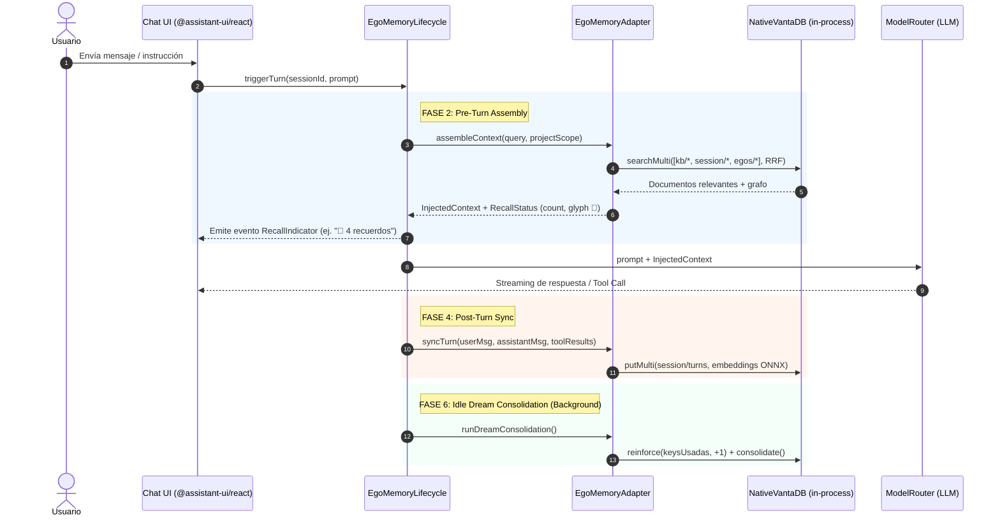

# Arquitectura Canónica: Ciclo de Vida de Memoria Unificado
### Fusión del Ciclo Operativo de Hermes Agent con el Sustrato Cognitivo VantaDB (L0–L3)

| Campo | Valor |
| --- | --- |
| Estado | Canónico — Decisión de Arquitectura P0 |
| Owner | ness-e |
| Módulos Clave | `packages/memory/EgoMemoryLifecycle.ts`, `packages/memory/EgoMemoryAdapter.ts` |
| Fuentes de Referencia | `repos-referencia/hermes-agent/agent/memory_provider.py` · VantaDB 0.8.0 (`NativeVantaDB`) |
| Fecha | 2026-10-07 |

---

## 1. El Problema y la Necesidad de Unificación

En la arquitectura de Ego existían dos modelos conceptuales de memoria que debían fusionarse:
1. **El Enfoque Operacional de Hermes Agent:** Centrado en el **ciclo por turno conversacional**: cuándo se inicializa, cuándo se consulta memoria previa al turno (`prefetch`), cuándo se guardan los hechos post-turno (`sync_turn`) y cómo se le informa al usuario qué recuerdos se inyectaron (indicador determinista 🧠 `RecallStatus`).
2. **El Enfoque Biológico/Estructural de VantaDB:** Centrado en el **sustrato y la consolidación de capas L0–L3**: Working Memory en disco LSM (Fjall), búsqueda híbrida densa/dispersa (HNSW ONNX + BM25 con RRF), bitemporalidad (`valid_at`, `recorded_at`), refuerzo Hebbiano (`reinforce`), checkpoints atómicos y consolidación en reposo (*Dream Consolidation*).

> **Tesis de Unificación:** Hermes define **CUÁNDO y CÓMO se interactúa a nivel de transporte conversacional**; VantaDB define **DÓNDE, CÓMO se persiste y CÓMO evoluciona el conocimiento cognitivo**. La unión de ambos constituye el `EgoMemoryLifecycle`.

---

## 2. Las 6 Fases del Ciclo de Vida de Memoria Unificado

```
┌─────────────────────────────────────────────────────────────────────────────┐
│                    EGO UNIFIED COGNITIVE MEMORY LIFECYCLE                   │
├─────────────────────────────────────────────────────────────────────────────┤
│  FASE 1: Session Admission & Warmup (Inicialización de Sesión)              │
│  FASE 2: Pre-Turn Context Assembly & Recall (Prefetch + Glifo 🧠)           │
│  FASE 3: Active Turn & Micro-Checkpoints (Ejecución de Tools)               │
│  FASE 4: Post-Turn Synchronization (Ingesta Inmediata L1 Fjall)             │
│  FASE 5: Pre-Compaction Checkpoint (Salvaguarda antes de comprimir)         │
│  FASE 6: Idle Dream Consolidation (Auto-Refuerzo en Segundo Plano)          │
└─────────────────────────────────────────────────────────────────────────────┘
```



---

## 3. Detalle Técnico de Cada Fase

### Fase 1: Session Admission & Warmup
* **Disparador:** Apertura de la app o selección de proyecto en el Dynamic Workspace.
* **Acción:**
  - `adapter.init()` verifica la salud del archivo `ego_memory.vdb` en `userData`.
  - Se cargan los manifiestos de los Sub-Egos registrados (`gov/sub_egos`).
  - Se recupera el contexto activo del proyecto (`workspace/active_project`).

### Fase 2: Pre-Turn Assembly & Prefetch (Inspirado en Hermes + VantaDB L2)
* **Disparador:** El usuario presiona Enter en el Composer.
* **Acción:**
  - `EgoMemoryAdapter.assembleContext()` ejecuta una búsqueda federada sobre VantaDB usando RRF (Reciprocal Rank Fusion) combinando HNSW (384d ONNX) y BM25 textual sobre los namespaces autorizados (`kb/*`, `project/*`, `egos/<id>/*`).
  - **Indicador Determinista (Hermes RecallStatus):** La UI recibe inmediatamente un metadato liviano:
    ```ts
    interface EgoRecallStatus {
      count: number;          // Cantidad de fragmentos inyectados
      glyph: string;          // "🧠" por defecto o marca de Sub-Ego
      sources: string[];      // Namespaces origen (ej. ["kb/docs", "egos/dev"])
      tokensEstimate: number; // Coste en tokens del contexto inyectado
    }
    ```
  - La interfaz de `@assistant-ui/react` pinta una insignia sutil (badge) informando al usuario exactamente qué memorias enriquecen su respuesta.

### Fase 3: Active Turn & Micro-Checkpoints
* **Disparador:** El modelo invoca herramientas que modifican archivos o estado.
* **Acción:**
  - Si la herramienta pertenece a la categoría de mutación (ej. editar código, alterar configuración), el sistema genera un checkpoint atómico en VantaDB (`task_checkpoint`) antes de la ejecución.
  - Si la tool falla o el usuario presiona `/undo`, se restaura el estado instantáneamente.

### Fase 4: Post-Turn Synchronization (`sync_turn`)
* **Disparador:** Fin del turno (modelo termina streaming y devuelve respuesta final).
* **Acción:**
  - El turno se serializa de forma inmutable y se escribe en VantaDB (`session/<sessionId>/turns/<turnId>`).
  - VantaDB genera en Rust el vector denso mediante ONNX Runtime (`multilingual-e5-small`) de forma asíncrona sin bloquear el hilo de Node.js.

### Fase 5: Pre-Compaction Checkpoint (Protección de Límite de Contexto)
* **Disparador:** El historial del chat se aproxima al 80% de la ventana de contexto del modelo.
* **Acción (Inspirada en `on_pre_compress` de Hermes v2):**
  - Antes de ejecutar la compactación o resumen del historial, Ego emite un checkpoint formal.
  - VantaDB extrae hechos estructurados del historial y los archiva en `kb/history_archive`.
  - Solo después se trunca o resume el historial en el prompt, garantizando que **nada se pierde**.

### Fase 6: Idle Dream Consolidation (Consolidación en Reposo)
* **Disparador:** Inactividad del usuario tras 5 minutos o cierre de sesión.
* **Acción:**
  - Un demonio en background analiza los turnos recientes:
    1. **Refuerzo Hebbiano (`reinforce`):** Las memorias y skills que se utilizaron con éxito incrementan su peso (`weight += delta`).
    2. **Causal Superseding (`supersede`):** Si una decisión previa fue contradicha o corregida por el usuario en este turno, la versión anterior se marca como obsoleta sin borrado físico, preservando la línea temporal.
    3. **Dream:** Síntesis de Micro-Memory-Documents en hechos duraderos del proyecto (`project/facts`).

---

## 4. Tarea Canónica en Backlog Maestro: `CORE-12`

* **ID:** `CORE-12`
* **Severidad:** 🔴 Crítica
* **Título:** Implementación del Ciclo de Vida de Memoria Unificado (`EgoMemoryLifecycle`)
* **Archivo:** `packages/memory/EgoMemoryLifecycle.ts`
* **Esfuerzo:** 🟡 2d
* **Prioridad:** 🔴 P0
* **Dependencias:** `CORE-06`, `CORE-07`
