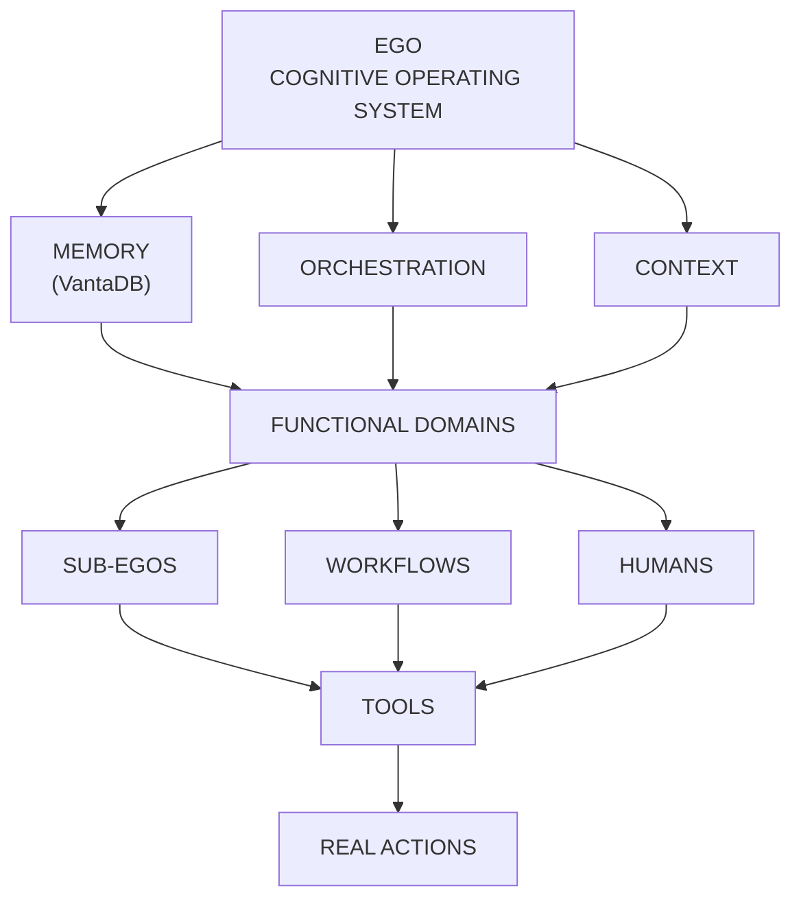

| Campo | Valor |
| --- | --- |
| Estado | Revisable — fuente vigente de taxonomía de dominios funcionales |
| Owner | ness-e |
| Fecha | 2026-10-06 |

# Taxonomía de Dominios Funcionales

## Principio rector
Ego cubre todas las áreas necesarias para construir y operar un proyecto, excepto aquellas que requieren certificación profesional formal (como contabilidad oficial o asesoramiento legal colegiado). Ego orquesta, rastrea, documenta, recomienda y ejecuta trabajo operativo, pero **no** sustituye a un contable certificado, abogado o auditor para propósitos legales o fiscales.

## Dominios, capacidades y Sub-Egos
El modelo se estructura en una separación de tres niveles:
1. **Dominio Funcional**: Qué trabajo existe (área de responsabilidad).
2. **Capacidad (Transversal)**: Qué puede hacer Ego transversalmente.
3. **Sub-Ego**: Quién hace el trabajo (instancias o plantillas dinámicas).

## Dominios funcionales principales (~14)

| Grupo | Dominio | Descripción |
| --- | --- | --- |
| **Strategic** | Strategy | Visión, OKRs, planificación, dirección. |
| **Product & Execution** | Product | Definición, roadmap, priorización. |
| | Project | Tareas, deadlines, coordinación. |
| | Operations | Procesos, logística, ejecución. |
| **Technology** | Engineering | Código, repos, issues, arquitectura. |
| | Infrastructure | DevOps, servidores, dominios. |
| | Data | Pipelines, análisis, experimentación. |
| **Growth & Relations**| Marketing | Posicionamiento, campañas, contenido, crecimiento. |
| | Sales/CRM | Leads, pipeline, clientes, relaciones. |
| | Support | Soporte, incidencias, feedback, retención. |
| | Community | Comunidad, engagement, moderación. |
| | Partnerships | Alianzas, afiliados, colaboraciones. |
| **Organization** | Finance | Inteligencia y operación financiera del proyecto (ingresos, gastos, presupuesto, cash flow, márgenes, pricing, unit economics, planificación). Ego no pretende ser un ERP ni un sistema de contabilidad fiscal formal. |
| | Legal/Compliance | Contratos, NDAs (sin asesoría legal). |
| | People/HR | Colaboradores, freelancers, contratistas, roles y onboarding para creadores individuales, escalando a HR completo posteriormente. |
| **Knowledge** | Knowledge | Conocimiento interno, documentación. |
| | Research | Investigación, fuentes, análisis. |
| **Experience** | Design | UX/UI, identidad visual. |
| | Content | Producción multimedia. |
| | Communications | Canales de comunicación. |

## Capacidades transversales
Las capacidades transversales cruzan todos los dominios funcionales. No son departamentos en sí mismos, sino habilidades del sistema que los Sub-Egos utilizan:

| Capacidad | Descripción | Relación con dominios |
| --- | --- | --- |
| **Memoria/KB** | Capacidad central del sistema implementada sobre el substrate VantaDB vía `EgoMemoryAdapter`; persiste el conocimiento y estado de todos los dominios en sus namespaces de `ego.namespaces.json`. | Transversal a todo el sistema. |
| **Research** | Puede apoyar estrategia, producto, marketing, legal, ingeniería, etc. | Utilizable por cualquier dominio que requiera investigación. |
| **Analytics** | Usada por prácticamente todos los dominios para extraer insights. | Transversal, orientada a datos. |
| **Governance** | Políticas, auditoría, permisos, decisiones, control. | Transversal y de control general. |
| **Voice/Transcription**| Modalidad de entrada y procesamiento, no un departamento. | Interfaz transversal. |
| **Journal** | Capacidad personal/contextual del usuario. | Enfocada en el usuario y su contexto. |
| **DevQA** | Capacidad especializada principalmente relacionada con ingeniería/conocimiento. | Transversal a tecnología. |

## Capacidades futuras
Ego es extensible. Las siguientes capacidades se añadirán cuando exista una necesidad real, sin requerir una redefinición de la arquitectura base:
- Content
- Social
- Email/Communications
- Learning
- Security
- Procurement
- Localization
- Compliance
- Recruiting

## Principio arquitectónico
El sistema es extensible por diseño y no exhaustivamente predefinido. 
- Un dominio puede tener N Sub-Egos.
- Un Sub-Ego puede cubrir N dominios.
- Múltiples Sub-Egos pueden colaborar en la misma tarea.
- El usuario puede crear Sub-Egos personalizados combinando dominios.
- **El número de Sub-Egos NO es una propiedad fija.**

## Principio de evolución
Ego acompaña el crecimiento del proyecto. El alcance funcional crece a través de: dominios + capacidades transversales + Sub-Egos especializados + herramientas + flujos de trabajo + memoria compartida + automatización. El sistema no escala simplemente añadiendo Sub-Egos, sino expandiendo sus capacidades funcionales integradas.
