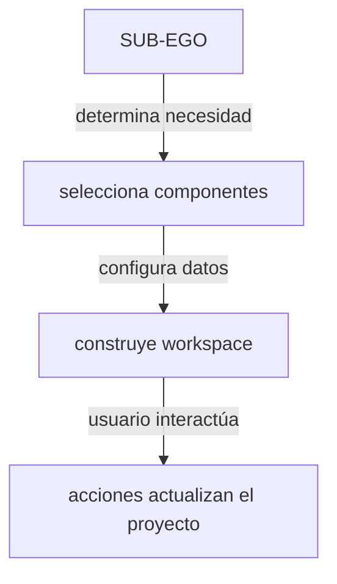

| Campo | Valor |
| --- | --- |
| Estado | Revisable — fuente vigente del sistema de componentes declarativos |
| Owner | ness-e |
| Fecha | 2026-10-06 |

## Principio
Ego no tiene una interfaz fija. Tiene un lenguaje de interfaces que la inteligencia puede utilizar para construir el espacio de trabajo que cada proyecto necesita. Los Sub-Egos deciden QUÉ construir. El UI Runtime decide CÓMO se renderiza y qué está permitido.

## Arquitectura del UI Runtime
La arquitectura sigue 4 niveles de interacción para la construcción de interfaces:



## Catálogo de componentes

| Categoría | Componente | Descripción |
| --- | --- | --- |
| **Primitivos** | Table | Datos tabulares, filtros, ordenamiento |
| | Chart | Gráficos: línea, barra, pie, área |
| | Form | Formularios de entrada/edición |
| | Card | Tarjetas de resumen/detalle |
| | Editor | Editor de texto/markdown/código |
| | Calendar | Vista temporal de eventos |
| | Board | Kanban/tablero de arrastre |
| **Datos** | Record View | Vista detallada de un registro |
| | Query View | Resultados de consulta |
| | Relation View | Visualización de relaciones/grafo |
| | Analytics View | Métricas agregadas |
| **Trabajo** | Task Board | Tablero de tareas con estados |
| | Roadmap | Planificación visual temporal |
| | Timeline | Línea de tiempo de eventos |
| | Workflow | Flujo de pasos/aprobaciones |
| **Agent Components** | Report | Informe estructurado (componentes de Sub-Ego) |
| | Recommendation | Sugerencia con justificación |
| | Approval | Solicitud de aprobación humana |
| | Action | Acción ejecutable |
| | Sub-Ego Collaboration | Vista de conversación/coordinación entre Sub-Egos |

## Contrato declarativo
Los Sub-Egos no escriben código HTML o React arbitrario, sino que emiten esquemas declarativos que representan un contrato estructurado.

Ejemplo de esquema JSON:
```json
{
  "type": "table",
  "data": "customers",
  "columns": ["name", "status", "last_purchase"],
  "actions": ["open_record", "edit", "create"]
}
```
Este contrato estructurado garantiza que la interfaz resultante sea segura, consistente y predecible.

## Gobernanza de la generación de UI
La arquitectura favorece un sistema de herramientas y componentes declarativos. Los Sub-Egos componen y configuran estos componentes según la necesidad. Esto provee:
- Consistencia visual
- Seguridad
- Validación de acciones
- Persistencia
- Accesibilidad
- Versionado
- Reutilización
- Menor costo de generación
- Compatibilidad futura de la plataforma

## Área de datos del sistema y frontera de seguridad
Ego tiene una sección persistente para la exploración y administración de los datos del proyecto. El usuario puede visualizar: tablas, campos, registros, relaciones (grafo), colecciones, vistas, consultas y métricas almacenadas en VantaDB.

### Guardrails de seguridad Electron
1. **Aislamiento absoluto del renderer:** El UI Runtime corre en un proceso Chromium estrictamente aislado (`sandbox=true`, `contextIsolation=true`, `nodeIntegration=false`). **El renderer NUNCA importa ni accede directamente a VantaDB ni a Node.js.**
2. **Mediación por IPC tipado:** Toda consulta a la memoria, mutación o recuperación de grafos se solicita a través del puente de precarga tipado (`preload.ts`), siendo despachada en el Main Process exclusivamente por `EgoMemoryAdapter`.
3. **Tipado de identificadores (`node_id`):** En `Record View`, `Relation View` y cualquier componente que maneje nodos del grafo de VantaDB, los identificadores son enteros `u128` de Rust y **deben tiparse y manipularse estrictamente como `string` en TypeScript/React** para evitar desbordamiento y corrupción numérica (`Number.MAX_SAFE_INTEGER`).

## Componentes y @assistant-ui/react
La librería `@assistant-ui/react` provee primitivas fundamentales: Thread, Composer, Message, Tool-UI.
`Tool-UI` es el mecanismo a través del cual los Sub-Egos renderizan componentes declarativos directamente en línea en el chat.
El área principal (Canvas) utiliza el mismo catálogo de componentes pero en un espacio de trabajo persistente y más amplio.
