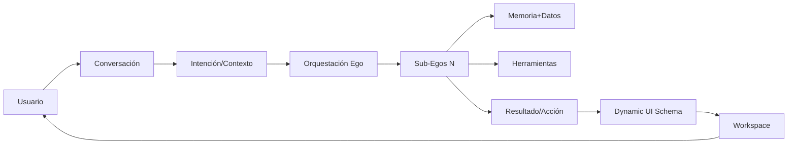
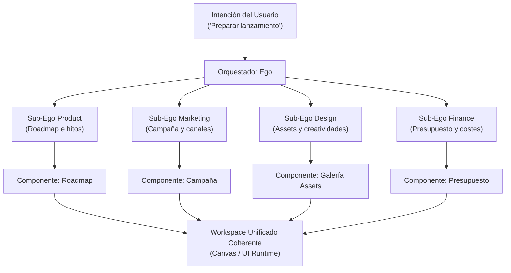

| Campo | Valor |
| --- | --- |
| Estado | Revisable — fuente vigente de principios de UI dinámica. Actualizado con Decisión P11 (Explicabilidad contextual) |
| Owner | ness-e |
| Fecha | 2026-10-06 |

## Principio de interfaz
"La interfaz sigue al trabajo, no obliga al trabajo a seguir la interfaz." 
El usuario nunca debería preguntarse "¿a qué sección debo entrar para hacer esto?". Simplemente debe decir "quiero hacer esto", y Ego se encarga de deducir y orquestar las capacidades, Sub-Egos, información, herramientas, acciones, interfaz y estado necesarios.

## Workspace cognitivo dinámico
Ego utiliza una interfaz dinámica y componible. El usuario dispone de un espacio de trabajo central (workspace) y la interacción principal se realiza mediante conversación. El sistema se adapta y construye la superficie visual necesaria en función del contexto, la tarea, los datos y el resultado requerido.

## Elementos permanentes
La arquitectura define 3 elementos permanentes (descartando paneles laterales rígidos de 320px o Canvas Causal fijo en P0):
- **Chat (Conversation River):** La interfaz universal de intención. El usuario expresa objetivos y Ego enruta internamente, respetando la regla de estabilidad visual del avatar.
- **Canvas / Dynamic Workspace:** El área de trabajo principal donde los Sub-Egos activos proyectan interfaces dinámicamente (tablas, formularios, dashboards, editores, diffs, diagramas).
- **Ego Activity Widget:** Componente permanente en el frame superior/dock para telemetría de ejecución en tiempo real, micro-animaciones reactivas a tools y resolución interactiva de aprobaciones HITL.

## Explicabilidad contextual (no es un panel permanente)
En concordancia con la Decisión P11, la explicabilidad en Ego opera como una **capacidad transversal del sistema** y no como un panel fijo o rígido de 320px:

- **Principio fundamental:** *"Ego debe ser explicable, pero no intrusivamente explicativo."*
- **Disponibilidad contextual:**
  - **Bajo demanda:** El usuario puede invocar en cualquier momento el control o consulta "¿Por qué?" sobre cualquier recomendación, dato o cambio propuesto para conocer su fundamentación.
  - **Proactiva:** Se activa automáticamente ante acciones con impacto relevante o destructivo previo a su ejecución.
- **Tres niveles progresivos de detalle:**
  1. **Nivel 1 (Usuario):** Justificación en lenguaje claro y accesible, síntesis de la causa directa.
  2. **Nivel 2 (Avanzado):** Fuentes consultadas, datos y registros de VantaDB, Sub-Egos intervinientes, herramientas ejecutadas y supuestos adoptados.
  3. **Nivel 3 (Auditoría):** Trazabilidad técnica total, telemetría de razonamiento y registro inmutable en `gov/audit`.
- **Terminología precisa:** Se adopta la denominación **"Evidencia y justificación de la decisión"** (sustituyendo formulaciones abstractas como "justificación matemática y semántica").
- **Explicabilidad frente a Aprobación:** La explicabilidad esclarece los motivos que fundamentan una propuesta, mientras que la aprobación es el mecanismo de gobernanza que autoriza su ejecución.
- **Evolución hacia Canvas Causal (Post-P0):** Canvas Causal R0 no es un requisito de P0 ni un panel fijo permanente. Se proyecta para fases posteriores como una herramienta avanzada de observabilidad, auditoría visual y razonamiento causal profundo.

## Modelo de interacción

## La interfaz se adapta al trabajo
Ejemplos de adaptación dinámica:
- Preguntar sobre clientes → Genera una vista de CRM.
- Analizar finanzas → Genera un dashboard financiero.
- Planificar un producto → Genera un roadmap, hitos y tareas.
- Trabajar en código → Genera explorador de archivos, diffs, issues y resultados de tests.

Estas son representaciones dinámicas, no secciones fijas permanentes de la aplicación.

## Los Sub-Egos construyen la interfaz que necesitan
Los Sub-Egos determinan qué información necesita ver el usuario y qué herramientas o componentes requiere la tarea específica.

El flujo de generación visual es:
**Sub-Ego** → determina necesidad → selecciona componentes → configura datos → construye workspace → usuario interactúa → acciones actualizan el proyecto.

## Separación entre interfaz y dominio
Tener un dominio funcional no implica tener una pantalla dedicada. Múltiples dominios pueden combinarse en un único workspace para resolver una sola tarea. 
"Los Sub-Egos y dominios representan capacidades del sistema, no necesariamente destinos de navegación."

## Composición multi-Sub-Ego
Un espacio de trabajo (workspace) **NO es propiedad de un único Sub-Ego**. Ego actúa como orquestador cognitivo, coordinando múltiples Sub-Egos para que contribuyan simultáneamente y conformen una superficie de interfaz unificada y coherente.

Por ejemplo, ante la intención del usuario *"Preparar lanzamiento"*, Ego no genera cuatro pantallas desconectadas ni obliga al usuario a navegar entre departamentos. En su lugar, orquesta y combina las aportaciones de:
- **Sub-Ego Product:** Genera el roadmap de release y la lista de hitos técnicos.
- **Sub-Ego Marketing:** Compone el calendario de campaña y canales de difusión.
- **Sub-Ego Design:** Presenta la galería de creatividades y assets de marca.
- **Sub-Ego Finance:** Expone la proyección de presupuesto y control de costes.

El resultado es un único workspace armónico donde cada Sub-Ego inyecta sus componentes declarativos correspondientes, colaborando en un mismo objetivo de negocio.

## Interactividad del Canvas
La parte visual no se limita a mensajes de texto. El Canvas es una superficie de trabajo interactiva: los Sub-Egos tienen la capacidad de renderizar tablas editables, dashboards, gráficos, formularios, tableros kanban, calendarios, líneas de tiempo, documentos, código, editores, comparadores y diagramas.

- **Contexto por selección:** Seleccionar un elemento en el Canvas lo convierte en contexto explícito para Ego. El usuario interactúa sobre lo seleccionado de manera fluida.
- **Transformación:** El Canvas se transforma y evoluciona dinámicamente durante la conversación según avanza la tarea.
- **Tipos de Canvas:** Temporal (para una tarea específica), Persistente (workspace guardado), Vista de datos (vista de una estructura de datos persistente) y Workspace de Sub-Ego.

## Estado de entrada dinámico
Al abrir Ego, el usuario no encuentra una plantilla de dashboard fija ni un chat vacío, sino un **estado dinámico del proyecto**.
- Generado dinámicamente por Ego y los Sub-Egos basándose en el estado real del proyecto.
- Construido utilizando el mismo sistema de componentes declarativos.
- Adapta su contenido para mostrar lo relevante en ese momento, enfocándose en la prioridad y las acciones necesarias.

## Qué NO es la UI de Ego
- NO son 23 departamentos mapeados a 23 pantallas fijas.
- NO es un chatbot básico donde absolutamente todo es texto.
- NO es una aplicación tradicional con una barra lateral de navegación rígida.
- NO es un layout rígido con un panel fijo permanente de 320px para explicabilidad (Canvas Causal R0).

## Qué SÍ es
Es un entorno de trabajo cognitivo donde el chat es el canal universal de comunicación, los Sub-Egos componen espacios de trabajo dinámicos utilizando componentes declarativos, las vistas de datos se generan según lo que realmente contiene el proyecto, y la interfaz en su totalidad es una extensión de la inteligencia del sistema.
