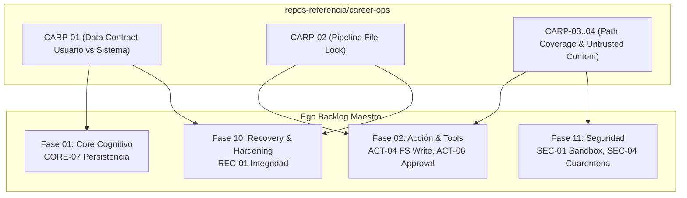

# Career-Ops Review & Extraction Backlog — Ego SOC

> **Propósito:** Registro canónico y secuencial de auditoría, extracción de patrones y adaptación del código fuente de `repos-referencia/career-ops` hacia el monorepo de Ego.
> **Regla de Operación:** *No copiar código directamente*. Extraer la separación formal de contratos entre datos de usuario vs sistema, los mecanismos de bloqueo de archivos durante escrituras concurrentes y los filtros de cuarentena para contenido no confiable.
> **Esquema:** Tabla canónica de 10 columnas:
> `| ID | Severidad | Hallazgo | Archivo Career-Ops | Esfuerzo | Prioridad | Estado | Descripción & Adaptación en Ego | Relaciones Ego | Dependencias |`

---

## 1. Resumen Ejecutivo de Tareas de Extracción

| Grupo de Trabajo | Rango IDs | Tareas | Fases de Ego Impactadas | Prioridad | Beneficio Principal |
|---|---|:---:|---|:---:|---|
| **A. Contrato Canónico de Datos** | `CARP-01` | 1 | Fase 01 (`CORE`), Fase 10 (`REC`) | 🔴 P0 | Distinción explícita de archivos mutables por el usuario vs inmutables por el sistema |
| **B. Concurrencia & Locks Atómicos** | `CARP-02` | 1 | Fase 02 (`ACT`), Fase 10 (`REC`) | 🔴 P0 | Exclusión mutua basada en lockfiles para herramientas de modificación de filesystem |
| **C. Cuarentena & Saneamiento** | `CARP-03..04` | 2 | Fase 02 (`ACT`), Fase 11 (`SEC`) | 🟠 P1 | Cuarentena de payloads no confiables y validación estricta de rutas de sistema |
| **TOTAL** | `CARP-01..04` | **4** | **Fases 01, 02, 10, 11** | — | **Ahorro estimado: 1-2 semanas de diseño de integridad de datos** |

---

## 2. Catálogo Detallado de Extracción (10 Columnas Canónicas)

| ID | Severidad | Hallazgo | Archivo Career-Ops | Esfuerzo | Prioridad | Estado | Descripción & Adaptación en Ego | Relaciones Ego | Dependencias |
|---|---|---|---|---|---|---|---|---|---|
| `CARP-01` | 🔴 Crítica | **Contrato Canónico de Separación de Capas (`DATA_CONTRACT.md`)** | `DATA_CONTRACT.md:1-200` | 🟢 0.5d | 🔴 P0 | 🆕 Pendiente | Extraer la directiva que separa categóricamente archivos del usuario (nunca sobreescritos automáticamente) de archivos de andamiaje y caches del sistema. | Ego: `CORE-07`, `REC-01` | — |
| `CARP-02` | 🔴 Crítica | **Mecanismo de exclusión mutua por lockfile (`pipeline-lock.mjs`)** | `pipeline-lock.mjs`, `tracker-writer-lock-tests.mjs` | 🟢 0.5d | 🔴 P0 | 🆕 Pendiente | Extraer el algoritmo de adquisición de lock atómico con timeout de espera para evitar colisiones cuando herramientas locales (`fs_write_file`) o agentes paralelos escriben en disco. | Ego: `ACT-04`, `REC-01` | — |
| `CARP-03` | 🟠 Alta | **Validación estricta de cobertura de rutas (`validate-system-paths-coverage.mjs`)** | `validate-system-paths-coverage.mjs` | 🟢 0.5d | 🟠 P1 | 🆕 Pendiente | Rutina que audita en tiempo de arranque que ninguna herramienta opere sobre rutas reservadas del sistema o del núcleo de Ego sin permiso explícito. | Ego: `ACT-04`, `SEC-01` | `CARP-01` |
| `CARP-04` | 🟠 Alta | **Cuarentena y validación de contenido no confiable (`validate-untrusted-content-coverage.mjs`)** | `validate-untrusted-content-coverage.mjs` | 🟢 0.5d | 🟠 P1 | 🆕 Pendiente | Extraer el pipeline que desinfecta payloads externos antes de su inyección en la memoria permanente de VantaDB o antes de pasarlos a ejecución. | Ego: `ACT-06`, `SEC-04` | — |

---

## 3. Integración en el Flujo de Construcción de Ego

