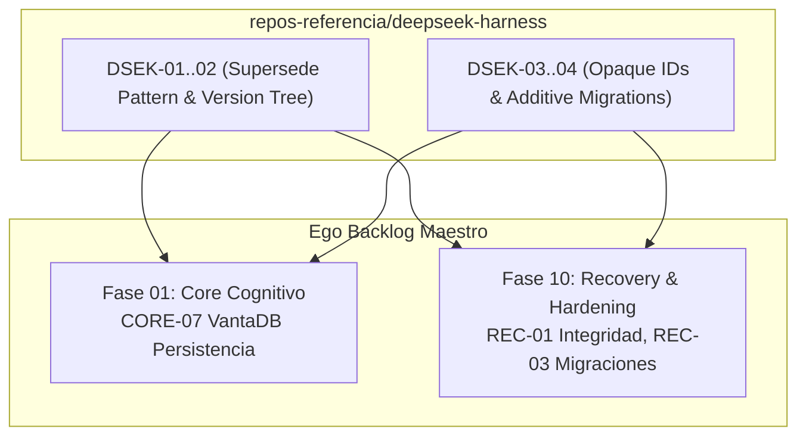

# DeepSeek-Harness Review & Extraction Backlog — Ego SOC

> **Propósito:** Registro canónico y secuencial de auditoría, extracción de patrones y adaptación del código fuente de `repos-referencia/deepseek-harness` hacia el monorepo de Ego.
> **Regla de Operación:** *No copiar código directamente*. Extraer el patrón de versionado de sesiones con IDs opacos y la estrategia de migraciones sin borrado destructivo (patrón supersede), adaptándolos a los namespaces de VantaDB Fjall LSM.
> **Esquema:** Tabla canónica de 10 columnas:
> `| ID | Severidad | Hallazgo | Archivo DeepSeek-Harness | Esfuerzo | Prioridad | Estado | Descripción & Adaptación en Ego | Relaciones Ego | Dependencias |`

---

## 1. Resumen Ejecutivo de Tareas de Extracción

| Grupo de Trabajo | Rango IDs | Tareas | Fases de Ego Impactadas | Prioridad | Beneficio Principal |
|---|---|:---:|---|:---:|---|
| **A. Versionado & Supersede** | `DSEK-01..02` | 2 | Fase 01 (`CORE`), Fase 10 (`REC`) | 🔴 P0 | Preservación del linaje histórico de registros sin mutaciones destructivas |
| **B. Identificadores Opacos & Migraciones** | `DSEK-03..04` | 2 | Fase 01 (`CORE`), Fase 10 (`REC`) | 🟠 P1 | Estabilidad de referencias de sesión e invariantes de esquema en VantaDB |
| **TOTAL** | `DSEK-01..04` | **4** | **Fases 01, 10** | — | **Ahorro estimado: 1-2 semanas de diseño de resiliencia histórica** |

---

## 2. Catálogo Detallado de Extracción (10 Columnas Canónicas)

| ID | Severidad | Hallazgo | Archivo DeepSeek-Harness | Esfuerzo | Prioridad | Estado | Descripción & Adaptación en Ego | Relaciones Ego | Dependencias |
|---|---|---|---|---|---|---|---|---|---|
| `DSEK-01` | 🔴 Crítica | **Patrón Canónico de Supersede Histórico (Soft-Replace)** | `snapshots/session/`, `ADR-028` | 🟢 0.5d | 🔴 P0 | ✅ Completada | Extraer la estrategia donde una mutación genera un nuevo registro y marca el anterior como `superseded_by` sin borrarlo. Implementado en `EgoMemoryAdapter.supersede`. | Ego: `CORE-07`, `REC-01` | — |
| `DSEK-02` | 🟠 Alta | **Reconstrucción de estado por árbol de versiones (`version-tree`)** | `snapshots/session/` | 🟢 1d | 🟠 P1 | 🆕 Pendiente | Algoritmo para consultar el estado actual de una clave o viajar en el tiempo siguiendo los punteros `superseded_by` e `is_latest` en VantaDB. | Ego: `CORE-07`, `REC-01` | `DSEK-01` |
| `DSEK-03` | 🟠 Alta | **Generación de identificadores de sesión opacos e inmutables** | `snapshots/session/` | 🟢 0.5d | 🟠 P1 | 🆕 Pendiente | Convención de nombrado seguro para hilos y entidades que desacopla la semántica del negocio de los punteros internos de almacenamiento. | Ego: `CORE-01`, `CORE-06` | — |
| `DSEK-04` | 🟡 Media | **Migraciones puramente aditivas sin eliminación de esquema** | `snapshots/session/` | 🟢 1d | 🟠 P1 | 🆕 Pendiente | Regla de evolución de esquemas de VantaDB que prohíbe el borrado de namespaces antiguos, garantizando retrocompatibilidad con dumps pasados. | Ego: `REC-03`, `REC-05` | — |

---

## 3. Integración en el Flujo de Construcción de Ego

