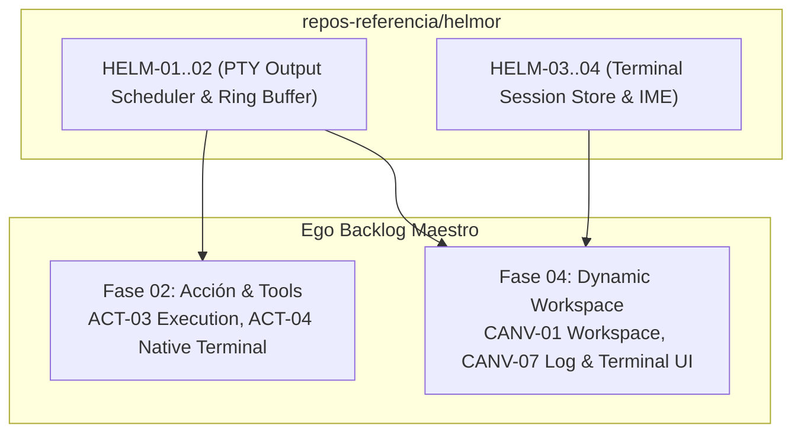

# Helmor Review & Extraction Backlog — Ego SOC

> **Propósito:** Registro canónico y secuencial de auditoría, extracción de patrones y adaptación del código fuente de `repos-referencia/helmor` hacia el monorepo de Ego.
> **Regla de Operación:** *No copiar código directamente*. Extraer la arquitectura de coalescencia de ráfagas PTY y el puente reactivo de sincronización UI, adaptándolos a TypeScript estricto en React 19 y Node 22 para las herramientas de terminal y visualización en Canvas.
> **Esquema:** Tabla canónica de 10 columnas:
> `| ID | Severidad | Hallazgo | Archivo Helmor | Esfuerzo | Prioridad | Estado | Descripción & Adaptación en Ego | Relaciones Ego | Dependencias |`

---

## 1. Resumen Ejecutivo de Tareas de Extracción

| Grupo de Trabajo | Rango IDs | Tareas | Fases de Ego Impactadas | Prioridad | Beneficio Principal |
|---|---|:---:|---|:---:|---|
| **A. Coalescencia de Terminal & PTY** | `HELM-01..02` | 2 | Fase 02 (`ACT`), Fase 04 (`CANV`) | 🔴 P0 | Previene congelamiento del Event Loop y de React ante salidas masivas de terminal |
| **B. Sincronización UI Reactiva** | `HELM-03..04` | 2 | Fase 04 (`CANV`), Fase 01 (`CORE`) | 🟠 P1 | Puente limpio de sincronización de eventos entre procesos sin suscripciones redundantes |
| **TOTAL** | `HELM-01..04` | **4** | **Fases 01, 02, 04** | — | **Ahorro estimado: 2 semanas de desarrollo de infraestructura de consola** |

---

## 2. Catálogo Detallado de Extracción (10 Columnas Canónicas)

| ID | Severidad | Hallazgo | Archivo Helmor | Esfuerzo | Prioridad | Estado | Descripción & Adaptación en Ego | Relaciones Ego | Dependencias |
|---|---|---|---|---|---|---|---|---|---|
| `HELM-01` | 🔴 Crítica | **Planificador de salida y coalescencia de terminal (`terminal-output-scheduler.ts`)** | `src/components/terminal-output-scheduler.ts:1-155` | 🟢 1d | 🔴 P0 | 🆕 Pendiente | Extraer el programador de drenado por cuotas (`scheduleDrain`, `DRAIN_CHUNK_CHARS: 16KB`, límites por tick de Event Loop) para amortiguar ráfagas masivas de comandos CLI (`terminal_exec`). | Ego: `ACT-04`, `CANV-07` | — |
| `HELM-02` | 🟠 Alta | **Manejo de buffer anular para repetición rápida (`ring-buffer cap`)** | `src/components/terminal-output-scheduler.ts:13-25` | 🟢 0.5d | 🔴 P0 | 🆕 Pendiente | Limitar la cola en memoria a un tope seguro (`MAX_QUEUE_CHARS: 2MB`), descartando lo más antiguo de forma determinista para evitar memory leaks en background runs. | Ego: `ACT-03`, `ACT-04` | `HELM-01` |
| `HELM-03` | 🟠 Alta | **Puente reactivo de estado de terminales (`terminal-session-store.ts`)** | `src/features/terminal/terminal-session-store.ts` | 🟢 1d | 🟠 P1 | 🆕 Pendiente | Extraer la gestión de ciclo de vida de sesiones de consola activas/inactivas con reactividad hacia el frontend sin re-renderizar todo el árbol. | Ego: `CANV-01`, `CANV-07` | — |
| `HELM-04` | 🟡 Media | **Mapeo y normalización de teclas de control y señales (`terminal-ime.ts`)** | `src/components/terminal-ime.ts` | 🟢 0.5d | 🟡 P2 | 🆕 Pendiente | Rutina para sanitizar inputs interactivos de terminal y propagación de señales `SIGINT` / `SIGTERM` desde la UI. | Ego: `ACT-04` | — |

---

## 3. Integración en el Flujo de Construcción de Ego

