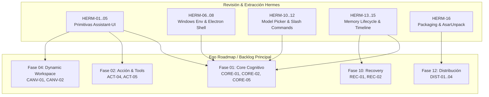

---
title: Hermes Agent Review & Extraction Backlog — Ego SOC
kind: review
status: active
description: "Backlog especializado para la revisión, extracción de patrones y adaptación técnica de hermes-agent hacia Ego."
tags: [ego, hermes-agent, extraction, review, desktop, assistant-ui, electron]
schema: "10-column canonical schema (.agents/references/backlog-format.md compatible)"
---

# Hermes Agent Review & Extraction Backlog — Ego SOC

> **Propósito:** Registro canónico y secuencial de auditoría, extracción de patrones y adaptación del código fuente de `repos-referencia/hermes-agent` hacia el monorepo de Ego.
> **Regla de Operación:** *No copiar código directamente*. Extraer la lógica de diseño, contratos y patrones arquitectónicos, reescribiendo limpiamente en TypeScript estricto, React 19 y Node 22 Main Process, apoyándose en VantaDB como sustrato de memoria.
> **Esquema:** Tabla canónica de 10 columnas:
> `| ID | Severidad | Hallazgo | Archivo Hermes | Esfuerzo | Prioridad | Estado | Descripción & Adaptación en Ego | Relaciones Ego | Dependencias |`

---

## 1. Resumen Ejecutivo de Tareas de Extracción

| Grupo de Trabajo | Rango IDs | Tareas | Fases de Ego Impactadas | Prioridad | Beneficio Principal |
|---|---|:---:|---|:---:|---|
| **A. Primitivas UI & Chat** | `HERM-01..05` | 5 | Fase 01 (`CORE`), Fase 02 (`ACT`), Fase 04 (`CANV`) | 🔴 P0 | Acelera desarrollo de Chat y Artifacts con `@assistant-ui/react` |
| **B. Shell Desktop & Windows** | `HERM-06..09` | 4 | Fase 01 (`CORE`), Fase 04 (`CANV`), Fase 11 (`SEC`) | 🔴 P0 | Resuelve bugs críticos de Electron en Windows (PATH, frameless, estado) |
| **C. Selectores & Comandos** | `HERM-10..12` | 3 | Fase 01 (`CORE`), Fase 03 (`SUB`) | 🟠 P1 | UX avanzada de Model Router, cambio de sesiones y comandos `/` |
| **D. Memoria, Estado & Empaquetado**| `HERM-13..16` | 4 | Fase 01 (`CORE`), Fase 07 (`TASK`), Fase 12 (`DIST`)| 🟠 P1 | Robustez en timeline de chat y distribución con Electron Builder |
| **E. Capacidades Evaluadas (RFCs)**| `HERM-17..19` | 3 | Fase 02 (`ACT`), Fase 03 (`SUB`) | 🟠 P1 | Aislamiento de Sub-Egos en Git, zero-context RPC y linter AST de tools |
| **TOTAL** | `HERM-01..19` | **19** | **Fases 01, 02, 03, 04, 07, 11, 12** | — | **Ahorro estimado: 5-7 semanas de ingeniería** |

---

## 2. Catálogo Detallado de Extracción (10 Columnas Canónicas)

| ID | Severidad | Hallazgo | Archivo Hermes | Esfuerzo | Prioridad | Estado | Descripción & Adaptación en Ego | Relaciones Ego | Dependencias |
|---|---|---|---|---|---|---|---|---|---|
| `HERM-01` | 🔴 Crítica | **Primitiva `artifact-card.tsx` para render de artefactos** | `apps/desktop/src/components/assistant-ui/artifact-card.tsx` | 🟢 1d | 🔴 P0 | 🆕 Pendiente | Extraer la arquitectura de tarjetas de artefactos con soporte para tabs de código/previsualización, copia rápida, acciones de exportación y colapso. Adaptar a TypeScript y Tailwind B/N de Ego. | Ego: `CORE-05`, `CANV-02` · Extracción: `docs/extractions/hermes-agent.md` §Bloque A | — |
| `HERM-02` | 🔴 Crítica | **Pipeline AST y sanitización en `markdown-text.tsx`** | `apps/desktop/src/components/assistant-ui/markdown-text.tsx` | 🟡 1-2d | 🔴 P0 | 🆕 Pendiente | Extraer el pipeline de renderizado markdown seguro: bloques colapsables adaptados para Explicabilidad, Evidencia y Auditoría ("¿Por qué?") con fuentes y contexto de VantaDB (nunca CoT crudo, §9), tablas, enlaces y prevención XSS. | Ego: `CORE-05`, `CANV-07` · Ver: `docs/architecture/arquitectura-unificada.md` §9 | — |
| `HERM-03` | 🟠 Alta | **Directiva interactiva HITL `ask-directive.tsx`** | `apps/desktop/src/components/assistant-ui/ask-directive.tsx` | 🟢 1d | 🔴 P0 | 🆕 Pendiente | Extraer el patrón de preguntas interactivas incrustadas en el flujo del chat (selección de opciones, formularios de confirmación). Adaptar para el sistema de aprobación humana de Tools. | Ego: `ACT-04`, `ACT-05` | `HERM-02` |
| `HERM-04` | 🟠 Alta | **Límite de error por mensaje `message-render-boundary.tsx`** | `apps/desktop/src/components/assistant-ui/message-render-boundary.tsx` | 🟢 0.5d | 🔴 P0 | 🆕 Pendiente | Extraer el Error Boundary granular para mensajes del Thread. Si un plugin o tool falla al renderizar un widget, solo aísla ese mensaje y no tumba el hilo completo. | Ego: `CORE-05`, `REC-04` | — |
| `HERM-05` | 🟡 Media | **Renderizado de secuencias ANSI `ansi-text.tsx`** | `apps/desktop/src/components/assistant-ui/ansi-text.tsx` | 🟢 0.5d | 🟡 P2 | 🆕 Pendiente | Extraer formateador de salidas de consola/terminal con colores ANSI para mostrar ejecución de herramientas CLI en la interfaz de chat. | Ego: `ACT-02`, `CANV-07` | — |
| `HERM-06` | 🔴 Crítica | **Resolución del entorno de usuario Windows `windows-user-env.ts`** | `apps/desktop/electron/windows-user-env.ts` | 🟢 0.5d | 🔴 P0 | 🆕 Pendiente | Extraer la lógica que repara el `process.env.PATH` en Windows al arrancar Electron para heredar comandos instalados en `%USERPROFILE%` y `AppData` (git, pnpm, node, etc.). | Ego: `CORE-01`, `DIST-01` | — |
| `HERM-07` | 🟠 Alta | **Fallback seguro de Sandbox en Windows `windows-sandbox-fallback.ts`** | `apps/desktop/electron/windows-sandbox-fallback.ts` | 🟢 1d | 🔴 P0 | 🆕 Pendiente | Extraer la rutina de detección de anomalías de sandbox en arquitecturas Windows x64 restringidas para prevenir crashes silenciosos al iniciar el renderer. | Ego: `CORE-02`, `SEC-01` | — |
| `HERM-08` | 🟠 Alta | **Persistencia de estado de ventana `window-state.ts`** | `apps/desktop/electron/window-state.ts` | 🟢 0.5d | 🔴 P0 | 🆕 Pendiente | Extraer la gestión de coordenadas, maximización y restauración de tamaño de BrowserWindow entre sesiones evitando parpadeos visuales al arrancar. | Ego: `CORE-01` | — |
| `HERM-09` | 🟡 Media | **Shell con split-pane reajustable `pane-shell/`** | `apps/desktop/src/components/pane-shell/` | 🟡 1-2d | 🔴 P0 | 🆕 Pendiente | Extraer el layout de paneles ajustables (sidebar de proyectos + chat principal + panel secundario de workspace/canvas) con persistencia de anchos en storage local. | Ego: `CANV-01` | — |
| `HERM-10` | 🟠 Alta | **Selector de modelos con búsqueda difusa `model-picker.tsx`** | `apps/desktop/src/components/model-picker.tsx` | 🟢 1d | 🔴 P0 | 🆕 Pendiente | Extraer el selector modal/dropdown de modelos con soporte para búsqueda difusa (`fuzzy.ts`), agrupación por proveedor (OpenAI, Anthropic, Google, Ollama) y visualización de capacidades. | Ego: `CORE-03`, `CORE-04` | — |
| `HERM-11` | 🟠 Alta | **Navegador y selector de sesiones `session-picker.tsx`** | `apps/desktop/src/components/session-picker.tsx` | 🟢 1d | 🔴 P0 | 🆕 Pendiente | Extraer el componente de cambio rápido de sesiones/hilos con previews de último mensaje, fechas y filtrado por nombre o proyecto. | Ego: `CORE-05`, `CORE-07` | — |
| `HERM-12` | 🟡 Media | **Parser y autocompletado de comandos slash `slash.ts`** | `apps/shared/src/slash.ts` | 🟢 0.5d | 🟠 P1 | 🆕 Pendiente | Extraer el parser declarativo de comandos `/` en el compositor para lanzar acciones rápidas (`/model`, `/subego`, `/compact`, `/help`). | Ego: `CORE-05`, `SUB-01` | — |
| `HERM-13` | 🟠 Alta | **Patrón de ciclo de vida e indicador de recall de memoria** | `agent/memory_provider.py` | 🟡 1d | 🔴 P0 | 🆕 Pendiente | Extraer el concepto formal de ciclo de vida de memoria (`initialize -> prefetch -> sync_turn`) y el indicador determinista de recall (`RecallStatus`, glyph 🧠) para mostrar al usuario los recuerdos inyectados por VantaDB. | Ego: `CORE-06`, `KB-03` | — |
| `HERM-14` | 🟠 Alta | **Semántica de timeline inmutable y rewind de sesión** | `hermes_state_timeline.py`, `hermes_state_rewind.py` | 🟡 1-2d | 🟠 P1 | 🆕 Pendiente | Extraer la lógica de branching y rebobinado de turnos de conversación. Implementar en Ego sobre namespaces `session/*` de VantaDB Fjall LSM (sin SQLite). | Ego: `CORE-07`, `REC-01` | `HERM-13` |
| `HERM-15` | 🟡 Media | **Auditoría de integridad al arrancar (Health Check)** | `hermes_state_health.py`, `hermes_state_maintenance.py` | 🟢 1d | 🟠 P1 | 🆕 Pendiente | Extraer la rutina de verificación de coherencia de base de datos y reparación suave al iniciar el proceso Main de Electron antes de abrir la UI. | Ego: `REC-02`, `REC-03` | — |
| `HERM-16` | 🟠 Alta | **Configuración de empaquetado y actualización Electron** | `apps/desktop/electron-builder.config.cjs`, `update-feed.cjs` | 🟡 1-2d | 🟠 P1 | 🆕 Pendiente | Extraer la configuración de empaquetado multiplataforma de Electron Builder con firma, auto-updater y exclusión explícita de `.node` nativos (`asarUnpack: ["**/*.node"]`). | Ego: `DIST-01`, `DIST-03`, `DIST-04` | — |
| `HERM-17` | 🟠 Alta | **Aislamiento de Subagentes con Git Worktrees (RFC-01)** | `tools/subagent_worktree.py` | 🟡 1-2d | 🟠 P1 | 🆕 Pendiente | Adaptar patrón de branching temporal (`git worktree`) para Sub-Egos de Ingeniería en Node.js, aislando modificaciones sin colisionar con el espacio de trabajo del usuario. | Ego: `SUB-07`, `SUB-08` · Ver: `docs/research/hermes-agent-deep-dive.md` §RFC-01 | — |
| `HERM-18` | 🟠 Alta | **Kernel de Ejecución Zero-Context RPC (RFC-02)** | `tools/code_execution_rpc.py`, `code_kernel.py` | 🟡 2d | 🟠 P1 | 🆕 Pendiente | Adaptar kernel in-process para encadenar herramientas locales programáticamente en un solo turno sin gastar múltiples turnos ni tokens de contexto del LLM (`node:vm`). | Ego: `ACT-07` · Ver: `docs/research/hermes-agent-deep-dive.md` §RFC-02 | — |
| `HERM-19` | 🟡 Media | **Auditoría AST y Linter de Skills (RFC-03)** | `tools/skills_ast_audit.py`, `skill_linter.py` | 🟢 1d | 🟠 P1 | 🆕 Pendiente | Extraer lógica de validación sintáctica y de seguridad sobre Abstract Syntax Trees para inspeccionar herramientas generadas dinámicamente antes de su registro. | Ego: `SUB-05` · Ver: `docs/research/hermes-agent-deep-dive.md` §RFC-03 | — |

---

## 3. Integración en el Flujo de Construcción de Ego

Para evitar dispersión y asegurar que la revisión de Hermes Agent no sea un ejercicio aislado, cada tarea del backlog `HERM-*` se ejecuta como **Pre-requisito de Diseño y Código** de las fases del Backlog Maestro de Ego (`docs/roadmap/Backlog.md`):

### Protocolo de Extracción por Tarea

1. **Lectura y Aislamiento:** Inspeccionar el archivo fuente en `repos-referencia/hermes-agent/` identificando dependencias externas.
2. **Eliminación de Acoplamiento:** Descartar capas de Python, JSON-RPC HTTP y dependencias de SQLite.
3. **Reescritura Canónica:** Escribir el componente o módulo en TypeScript dentro de `apps/desktop/` o `packages/`, cumpliendo el tipado estricto (`tsconfig.json`) y las directrices de `AGENTS.md`.
4. **Verificación:** Probar de forma aislada en Storybook / Vitest / E2E antes de integrarlo en el hilo principal de Ego.
5. **Cierre de Tarea:** Marcar la tarea en este backlog como `✅ DONE` e indicar el archivo de destino en Ego.
