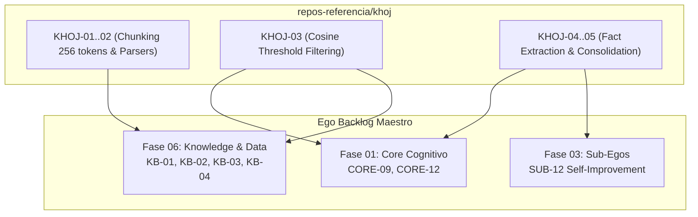

# Khoj Review & Extraction Backlog — Ego SOC

> **Propósito:** Registro canónico y secuencial de auditoría, extracción de patrones y adaptación del código fuente de `repos-referencia/khoj` hacia el monorepo de Ego.
> **Regla de Operación:** *No copiar código directamente*. Khoj es Python FastAPI; Ego extrae únicamente la lógica algorítmica (chunking de 256 tokens con deduplicación, filtrado coseno por umbral y heurísticas de extracción de hechos) adaptándola a TypeScript estricto sobre VantaDB nativo (BM25 Fast Path y L0-L3 Cognitive Path).
> **Esquema:** Tabla canónica de 10 columnas:
> `| ID | Severidad | Hallazgo | Archivo Khoj | Esfuerzo | Prioridad | Estado | Descripción & Adaptación en Ego | Relaciones Ego | Dependencias |`

---

## 1. Resumen Ejecutivo de Tareas de Extracción

| Grupo de Trabajo | Rango IDs | Tareas | Fases de Ego Impactadas | Prioridad | Beneficio Principal |
|---|---|:---:|---|:---:|---|
| **A. Chunking & Ingesta** | `KHOJ-01..02` | 2 | Fase 06 (`KB`), Fase 01 (`CORE`) | 🟠 P1 | Chunking semántico de 256 tokens con deduplicación de hash y metadatos |
| **B. Búsqueda Híbrida & Umbrales** | `KHOJ-03` | 1 | Fase 06 (`KB`), Fase 01 (`CORE`) | 🟠 P1 | Filtrado de resultados semánticos por corte de umbral de similitud coseno |
| **C. Extracción Cognitiva de Hechos** | `KHOJ-04..05` | 2 | Fase 01 (`CORE`), Fase 06 (`KB`), Fase 03 (`SUB`) | 🟠 P1 | Heurísticas estructuradas para extraer hechos persistentes de conversaciones |
| **TOTAL** | `KHOJ-01..05` | **5** | **Fases 01, 03, 06** | — | **Ahorro estimado: 2-3 semanas de desarrollo de RAG** |

---

## 2. Catálogo Detallado de Extracción (10 Columnas Canónicas)

| ID | Severidad | Hallazgo | Archivo Khoj | Esfuerzo | Prioridad | Estado | Descripción & Adaptación en Ego | Relaciones Ego | Dependencias |
|---|---|---|---|---|---|---|---|---|---|
| `KHOJ-01` | 🟠 Alta | **Algoritmo de fragmentación de texto con solapamiento y deduplicación** | `src/khoj/processor/text_to_entries.py:45-120` | 🟢 1d | 🟠 P1 | 🆕 Pendiente | Extraer la estrategia de segmentación en chunks de 256 tokens con solapamiento y cálculo de digest SHA-256 para evitar inserciones duplicadas en VantaDB. | Ego: `KB-01`, `KB-02` | — |
| `KHOJ-02` | 🟡 Media | **Procesadores específicos por formato (Markdown, Org, PDF, DOCX)** | `src/khoj/processor/markdown_to_entries.py`, `pdf_to_entries.py` | 🟡 1-2d | 🟠 P1 | 🆕 Pendiente | Extraer extractores de texto limpios con preservación de encabezados jerárquicos como metadatos de contexto antes de indexar. | Ego: `KB-01` | `KHOJ-01` |
| `KHOJ-03` | 🟠 Alta | **Filtrado por umbral de similitud y descarte de ruido semántico** | `src/khoj/search_type/text_search.py:80-140` | 🟢 1d | 🟠 P1 | 🆕 Pendiente | Extraer la lógica de corte dinámico de score coseno (`score_threshold`) para descartar coincidencias de baja confianza en la recuperación híbrida de VantaDB. | Ego: `CORE-09`, `KB-03` | — |
| `KHOJ-04` | 🟠 Alta | **Heurística de extracción de hechos atómicos (`extract_facts`)** | `src/khoj/routers/helpers.py:150-210` | 🟢 1d | 🟠 P1 | 🆕 Pendiente | Extraer el prompt estructurado y el parser que sintetiza hechos clave de usuario a partir del hilo de conversación para inserción en `egos/memory/facts/`. | Ego: `CORE-12`, `KB-04` | — |
| `KHOJ-05` | 🟡 Media | **Actualización y consolidación autónoma de memorias (`ai_update_memories`)** | `src/khoj/routers/helpers.py:220-290` | 🟡 1d | 🟠 P1 | 🆕 Pendiente | Extraer el flujo de consolidación que compara hechos nuevos con existentes para resolver contradicciones o reforzar memorias (Dream consolidation). | Ego: `CORE-12`, `SUB-12` | `KHOJ-04` |

---

## 3. Integración en el Flujo de Construcción de Ego

