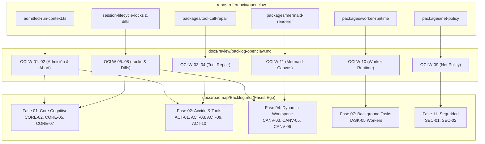

# OpenClaw Review & Extraction Backlog — Ego SOC

> **Propósito:** Registro canónico y secuencial de auditoría, extracción de patrones y adaptación técnica de `repos-referencia/openclaw` hacia el monorepo de Ego.
> **Regla de Operación:** *No copiar código directamente*. Extraer la lógica de diseño, contratos y patrones arquitectónicos en TypeScript nativo, apoyándose en VantaDB como sustrato de memoria y Electron IPC para la UI.
> **Esquema:** Tabla canónica de 10 columnas:
> `| ID | Severidad | Hallazgo | Archivo OpenClaw | Esfuerzo | Prioridad | Estado | Descripción & Adaptación en Ego | Relaciones Ego | Dependencias |`

---

## 1. Resumen Ejecutivo de Tareas de Extracción

| Grupo de Trabajo | Rango IDs | Tareas | Fases de Ego Impactadas | Prioridad | Beneficio Principal |
|---|---|:---:|---|:---:|---|
| **A. Gobernanza & Admisión** | `OCLW-01..02` | 2 | Fase 01 (`CORE`), Fase 02 (`ACT`) | 🔴 P0 | Contexto inmutable de runs y cancelación nativa con `AbortSignal` |
| **B. Resiliencia de Tools** | `OCLW-03..04` | 2 | Fase 02 (`ACT`) | 🔴 P0 | Auto-reparación de JSON malformado emitido por modelos pequeños |
| **C. Sesiones & Diffs** | `OCLW-05..08` | 4 | Fase 01 (`CORE`), Fase 02 (`ACT`), Fase 04 (`CANV`)| 🟠 P1 | Locks atómicos de sesión, paginación y seguimiento de diffs |
| **D. Seguridad, Workers & Canvas** | `OCLW-09..12` | 4 | Fase 04 (`CANV`), Fase 07 (`TASK`), Fase 11 (`SEC`)| 🟠 P1 | Protección anti-SSRF, worker threads y Mermaid para Canvas |
| **E. Recuperación & Workboards**| `OCLW-13..15` | 3 | Fase 07 (`TASK`), Fase 09 (`DOM`), Fase 10 (`REC`)| 🟡 P2 | Recuperación de fallos de proceso y contratos de tareas |
| **TOTAL** | `OCLW-01..15` | **15** | **Fases 01, 02, 04, 07, 09, 10, 11** | — | **Ahorro estimado: 4-5 semanas de desarrollo** |

---

## 2. Catálogo Detallado de Extracción (10 Columnas Canónicas)

| ID | Severidad | Hallazgo | Archivo OpenClaw | Esfuerzo | Prioridad | Estado | Descripción & Adaptación en Ego | Relaciones Ego | Dependencias |
|---|---|---|---|---|---|---|---|---|---|
| `OCLW-01` | 🔴 Crítica | **Contexto inmutable de admisión `admitted-run-context.ts`** | `src/agents/admitted-run-context.ts` | 🟢 1d | 🔴 P0 | 🆕 Pendiente | Extraer la arquitectura de tokens de admisión inmutables (`AdmittedRunContext`, `OperationalRunInstanceRef`) para trazar `runId`, `instanceId` y auditoría en cada turno del Cognitive Runtime. | Ego: `ACT-01`, `ACT-03` · Extracción: `docs/extractions/openclaw.md` §Bloque A | — |
| `OCLW-02` | 🔴 Crítica | **Propagación de autoridad y `AbortSignal` en ejecuciones** | `src/agents/admitted-run-context.ts:43-60` | 🟢 0.5d | 🔴 P0 | ✅ Completada | Extraer el patrón de propagación de `AbortSignal` en cancelaciones operativas implementado en `ExecutionManager.ts` con cancelación cooperativa y límites de tiempo. | Ego: `CORE-02`, `ACT-03` | `OCLW-01` |
| `OCLW-03` | 🔴 Crítica | **Motor de auto-reparación de Tool Calls (`tool-call-repair`)** | `packages/tool-call-repair/` | 🟡 1-2d | 🔴 P0 | 🆕 Pendiente | Extraer el paquete de auto-reparación de llamadas a herramientas malformadas producidas por modelos LLM (JSON truncado, comillas rotas, parámetros mal convertidos) sin quemar turnos extra. | Ego: `ACT-01`, `ACT-09` (RFC-OCLW-01) | — |
| `OCLW-04` | 🟠 Alta | **Heurísticas de normalización de argumentos de herramientas** | `packages/tool-call-repair/src/` | 🟢 1d | 🔴 P0 | 🆕 Pendiente | Extraer normalizadores deterministas que corrigen esquemas de argumentos (ej. convertir strings numéricos a enteros, arrays unielemento) antes de ejecutar el validador Zod. | Ego: `ACT-01` | `OCLW-03` |
| `OCLW-05` | 🟠 Alta | **Locks atómicos por sesión `session-lifecycle-locks.ts`** | `src/sessions/session-lifecycle-locks.ts` | 🟢 0.5d | 🔴 P0 | 🆕 Pendiente | Extraer la exclusión mutua de sesión para evitar que eventos asíncronos concurrentes (background task + input usuario) muten la secuencia de turnos en VantaDB al mismo tiempo. | Ego: `CORE-07`, `REC-01` | — |
| `OCLW-06` | 🟠 Alta | **Ventanas deslizantes de lectura `transcript-read-window.ts`** | `src/sessions/transcript-read-window.ts` | 🟢 1d | 🔴 P0 | 🆕 Pendiente | Extraer el algoritmo de ventanas paginadas de transcripción para hilos de chat masivos, reduciendo la huella de memoria en RAM al cargar mensajes en `@assistant-ui/react`. | Ego: `CORE-05`, `CORE-07` | — |
| `OCLW-07` | 🟠 Alta | **Grafo de seguimiento de revisiones y diffs acumulados** | `src/sessions/session-diff-revisions.ts` | 🟡 1-2d | 🟠 P1 | 🆕 Pendiente | Extraer el rastreador de cambios sobre archivos por sesión para mostrar al usuario un resumen unificado de archivos modificados por los Sub-Egos en el Dynamic Workspace. | Ego: `ACT-10`, `CANV-06` (RFC-OCLW-02) | — |
| `OCLW-08` | 🟡 Media | **Parser determinista de parches unificados `session-diff-parser.ts`** | `src/sessions/session-diff-parser.ts` | 🟢 1d | 🟠 P1 | 🆕 Pendiente | Extraer parser de diffs Git y unidiff para formatear y colorear cambios de código antes de enviarlos a previsualización en el Canvas. | Ego: `CANV-02`, `CANV-06` | `OCLW-07` |
| `OCLW-09` | 🔴 Crítica | **Política de seguridad de red anti-SSRF `net-policy`** | `packages/net-policy/` | 🟢 1d | 🔴 P0 | 🆕 Pendiente | Extraer el validador estricto de URLs que bloquea peticiones de tools a `127.0.0.1`, redes privadas o endpoints de metadatos de nube al hacer scraping o llamadas HTTP. | Ego: `SEC-01`, `SEC-02` | — |
| `OCLW-10` | 🟠 Alta | **Runtime de Workers en Node.js `worker-runtime`** | `packages/worker-runtime/` | 🟡 1-2d | 🟠 P1 | 🆕 Pendiente | Extraer el harness de ejecución de tareas pesadas en `worker_threads` independientes para asegurar que el cómputo de fondo nunca congele el hilo principal de Electron. | Ego: `TASK-05` (RFC-OCLW-03) | — |
| `OCLW-11` | 🟡 Media | **Renderizado y validación reactiva de diagramas Mermaid** | `packages/mermaid-renderer/` | 🟢 1d | 🟠 P1 | 🆕 Pendiente | Extraer el módulo de validación sintáctica y generación SVG de diagramas Mermaid para renderizado declarativo dentro del Canvas del Workspace Dinámico. | Ego: `CANV-03`, `CANV-05` | — |
| `OCLW-12` | 🟡 Media | **Compilación de formularios interactivos `structured-input.ts`** | `src/agents/harness/structured-input.ts` | 🟢 1d | 🟠 P1 | 🆕 Pendiente | Extraer el generador de esquemas para entradas estructuradas y preguntas al usuario, complementando la directiva `ask-directive.tsx` de Hermes. | Ego: `ACT-04` | — |
| `OCLW-13` | 🟡 Media | **Mecanismo de detección y auto-recuperación de proceso** | `src/entry.respawn.ts`, `node-runtime-recovery.mjs`| 🟢 1d | 🟠 P1 | 🆕 Pendiente | Extraer la lógica de respawn con preservación de estado ante crashes no controlados para garantizar tolerancia a fallos del proceso Main. | Ego: `REC-02`, `REC-03` | — |
| `OCLW-14` | 🟢 Baja | **Despachador tipado de actividad de herramientas** | `src/infra/agent-activity-events.js` | 🟢 0.5d | 🟡 P2 | 🆕 Pendiente | Extraer el bus de eventos de telemetría de herramientas (`tool_start`, `tool_progress`, `tool_end`) para alimentar la bandeja de Background Activity de Ego. | Ego: `CANV-08`, `TASK-02` | — |
| `OCLW-15` | 🟢 Baja | **Contratos tipados de Workboard / Tableros de Tareas** | `packages/workboard-contract/` | 🟢 1d | 🟡 P2 | 🆕 Pendiente | Extraer esquemas y contratos de tableros de tareas para el dominio funcional de Gestión de Proyectos / Product Management. | Ego: `DOM-02` | — |

---

## 3. Integración en el Flujo de Construcción de Ego

El catálogo `OCLW-*` se enlaza directamente con los hitos del Backlog Maestro de Ego:

### Protocolo de Extracción por Tarea

1. **Lectura directa en TypeScript:** Al ser TypeScript nativo, verificar contratos de tipos con `pnpm --filter @ego/desktop build`.
2. **Desacoplar de SQLite:** Conectar todas las operaciones de almacenamiento a las llamadas correspondientes en `EgoMemoryAdapter` (VantaDB).
3. **Validar IPC:** Asegurar que ningún objeto de contexto interno de Node se exponga directamente al Renderer sin serialización tipada.
